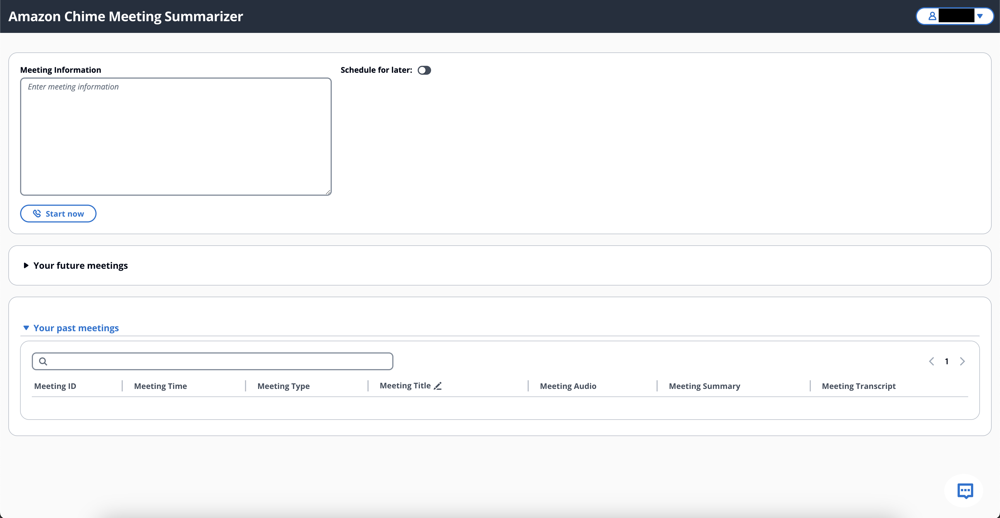

# Getting Started

This getting started guide will walk you through setting up a new CDK project.

## Pre-requisites

Before diving into the project setup, make sure you have the following requirements in place:

- **Yarn**: [Yarn](https://classic.yarn.pkg.com/lang/en/docs/install) must be installed on your machine. 
- **AWS Account**: You'll need an active AWS account.
- **Anthropic Models**: These models should be enabled in your AWS Account. Learn more about enabling them [here](https://docs.aws.amazon.com/bedrock/latest/userguide/model-access.html).
- **Amazon Titan**: Ensure that Amazon Titan is activated in your AWS Account. Learn more about enabling them [here](https://docs.aws.amazon.com/bedrock/latest/userguide/titan-models.html).

## Setting Up Your Project

To effectively utilize the `Amazon Chime SDK Meeting Summarizer`, your environment should have [Node.js](https://nodejs.org/en/) and [Yarn](https://classic.yarn.pkg.com/lang/en/docs/install) pre-installed.

Follow the below instructions to deploy the solution:

## Deployment Process

Execute the following command in your terminal to deploy the project:

```
yarn launch
```

Example output:

```
yarn run v1.22.22
$ npx projen launch
👾 launch | yarn && yarn projen && yarn build && yarn cdk bootstrap && yarn cdk deploy  --require-approval never && yarn configLocal
[1/4] 🔍  Resolving packages...
[2/4] 🚚  Fetching packages...
[3/4] 🔗  Linking dependencies...
[4/4] 🔨  Building fresh packages...
success Saved lockfile.
$ npx projen
👾 default | ts-node --project tsconfig.dev.json .projenrc.ts
$ npx projen build
👾 build » default | ts-node --project tsconfig.dev.json .projenrc.ts
👾 build » post-compile » synth:silent | cdk synth -q
Bundling asset AmazonChimeSDKMeetingSummarizer/chimeSDKResources/smaHandlerLambda/Code/Stage...
Bundling asset AmazonChimeSDKMeetingSummarizer/Site/DeployBucket/Asset1/Stage...
0.20.2
[1/4] 🔍  Resolving packages...
success Already up-to-date.
$ webpack --config webpack.config.js --mode production
asset bundle.js 2.47 MiB [compared for emit] [minimized] [big] (name: main) 1 related asset
asset index.html 648 bytes [compared for emit]
orphan modules 6.23 MiB [orphan] 2543 modules
runtime modules 4.86 KiB 10 modules
built modules 4.92 MiB [built]
  modules by path ./node_modules/ 3.81 MiB 565 modules
  modules by path ./src/ 952 KiB
    modules by path ./src/*.tsx 59.9 KiB 5 modules
    modules by path ./src/styles/*.css 2.08 KiB 2 modules
    modules by path ./src/pages/*.tsx 890 KiB 2 modules
  asset modules 179 KiB
    data:font/woff2;base64,d09GMgABAAAAAEE8.. 21.9 KiB [built] [code generated]
    data:font/woff2;base64,d09GMgABAAAAAEV8.. 23.3 KiB [built] [code generated]
    data:font/woff2;base64,d09GMgABAAAAAEE0.. 21.9 KiB [built] [code generated]
    data:font/woff2;base64,d09GMgABAAAAAEVo.. 23.3 KiB [built] [code generated]
    + 4 modules
This can impact web performance.
Assets: 
  bundle.js (2.47 MiB)
performance.
Entrypoints:
  main (2.47 MiB)
      bundle.js
You can limit the size of your bundles by using import() or require.ensure to lazy load some parts of your application.
For more info visit https://webpack.js.org/guides/code-splitting/
👾 build » test » eslint | eslint --ext .ts,.tsx --fix --no-error-on-unmatched-pattern  src test build-tools projenrc .projenrc.ts
=============
You may find that it works just fine, or you may not.

SUPPORTED TYPESCRIPT VERSIONS: >=4.3.5 <5.4.0

YOUR TYPESCRIPT VERSION: 5.4.2

Please only submit bug reports when using the officially supported version.
=============
✨  Synthesis time: 27.68s

AmazonChimeSDKMeetingSummarizer:  start: Building 840224d55457a9eb6799fac109422f47422243bf4badd7122f41eee2b28dbda2:<ACCOUNT-ID>-us-east-1
AmazonChimeSDKMeetingSummarizer:  success: Built 840224d55457a9eb6799fac109422f47422243bf4badd7122f41eee2b28dbda2:<ACCOUNT-ID>-us-east-1
AmazonChimeSDKMeetingSummarizer:  start: Publishing 840224d55457a9eb6799fac109422f47422243bf4badd7122f41eee2b28dbda2:<ACCOUNT-ID>-us-east-1
AmazonChimeSDKMeetingSummarizer:  start: Building e48d87a0b5f074aada5304444e83b794b0b114f2a4eef83797bd5c7e4d041a63:<ACCOUNT-ID>-us-east-1
AmazonChimeSDKMeetingSummarizer:  success: Built e48d87a0b5f074aada5304444e83b794b0b114f2a4eef83797bd5c7e4d041a63:<ACCOUNT-ID>-us-east-1
AmazonChimeSDKMeetingSummarizer:  start: Building 0c3aaf7163151bd99b727b2fb4bc0acc75a12e21e23d5122a0aeaef6a4e2d8dc:<ACCOUNT-ID>-us-east-1
AmazonChimeSDKMeetingSummarizer:  success: Built 0c3aaf7163151bd99b727b2fb4bc0acc75a12e21e23d5122a0aeaef6a4e2d8dc:<ACCOUNT-ID>-us-east-1
AmazonChimeSDKMeetingSummarizer:  start: Publishing e48d87a0b5f074aada5304444e83b794b0b114f2a4eef83797bd5c7e4d041a63:<ACCOUNT-ID>-us-east-1
AmazonChimeSDKMeetingSummarizer:  start: Publishing 0c3aaf7163151bd99b727b2fb4bc0acc75a12e21e23d5122a0aeaef6a4e2d8dc:<ACCOUNT-ID>-us-east-1
AmazonChimeSDKMeetingSummarizer:  success: Published e48d87a0b5f074aada5304444e83b794b0b114f2a4eef83797bd5c7e4d041a63:<ACCOUNT-ID>-us-east-1
AmazonChimeSDKMeetingSummarizer:  success: Published 840224d55457a9eb6799fac109422f47422243bf4badd7122f41eee2b28dbda2:<ACCOUNT-ID>-us-east-1
AmazonChimeSDKMeetingSummarizer:  success: Published 0c3aaf7163151bd99b727b2fb4bc0acc75a12e21e23d5122a0aeaef6a4e2d8dc:<ACCOUNT-ID>-us-east-1
AmazonChimeSDKMeetingSummarizer: deploying... [1/1]
AmazonChimeSDKMeetingSummarizer: creating CloudFormation changeset...

 ✅  AmazonChimeSDKMeetingSummarizer

✨  Deployment time: 161.49s

Outputs:
AmazonChimeSDKMeetingSummarizer.InfrastructuremeetingSummarizerAPIEndpoint42D7AD92 = https://<API-GW-ID>.execute-api.us-east-1.amazonaws.com/prod/
AmazonChimeSDKMeetingSummarizer.collectionName = chatbot-knowledge-base-1cd6d7
AmazonChimeSDKMeetingSummarizer.dataSourceId = DQLCRHFZAV
AmazonChimeSDKMeetingSummarizer.knowledgeBaseId = KDVB0KKPIC
AmazonChimeSDKMeetingSummarizer.knowledgeBaseRoleArn = arn:aws:iam::<ACCOUNT-ID>:role/AmazonChimeSDKMeetingSumm-BedrockKnowledgeBaseResou-sqMyOihXF5OH
AmazonChimeSDKMeetingSummarizer.siteBucket = amazonchimesdkmeetingsumm-sitewebsitebucketbc20a56-<BUCKET-ID>
AmazonChimeSDKMeetingSummarizer.summarizerSite = <CLOUDFRONT-ID>.cloudfront.net
Stack ARN:
arn:aws:cloudformation:us-east-1:<ACCOUNT-ID>:stack/AmazonChimeSDKMeetingSummarizer/47457510-ed8d-11ee-95b2-12152d099d29

✨  Total time: 189.16s

$ npx projen configLocal
👾 configLocal | aws s3 cp s3://$(yarn run --silent getBucket)/config.json site/public/
👾 getBucket | aws cloudformation describe-stacks --stack-name AmazonChimeSDKMeetingSummarizer --region us-east-1 --query 'Stacks[0].Outputs[?OutputKey==`siteBucket`].OutputValue' --output text
download: s3://amazonchimesdkmeetingsumm-sitewebsitebucketbc20a56-<BUCKET-ID>/config.json to site/public/config.json
```

## Frontend Access

To begin scheduling your meetings through the frontend, simply utilize the AWS CloudFront URL provided upon the completion of the CDK deployment process. This URL serves as your access point to the user-friendly meeting scheduling interface.



## Clean-up Process

To remove the deployed resources and clean up your environment, use:

```
yarn cdk destroy
```

This guide aims to provide a clear path for setting up your CDK project. Should you encounter any issues or have questions, feel free to open an issue [here](https://github.com/aws-samples/amazon-chime-sdk-meeting-summarizer/issues).