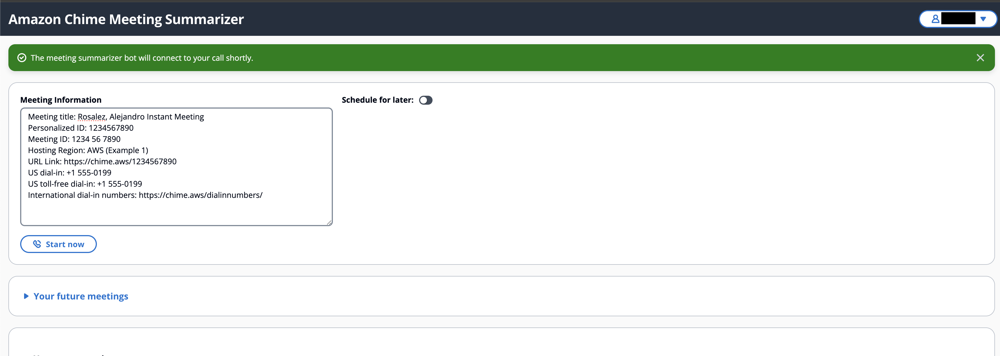
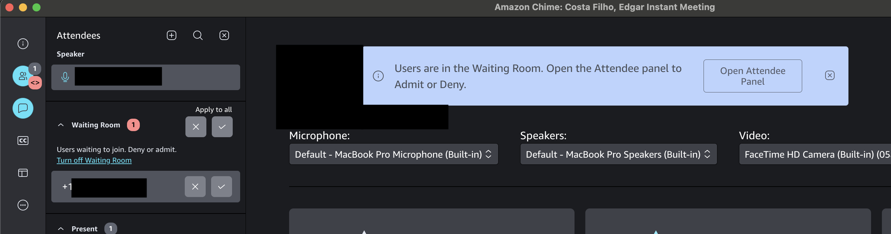
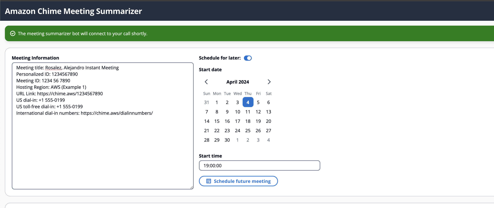
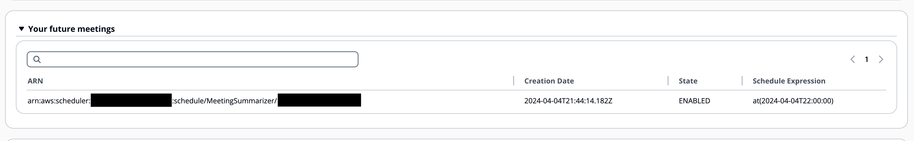

# Scheduling a Meeting with the SDK Summarizer Bot 

Easily integrate the `Chime Summarizer Bot` into your meetings, whether they are about to start or scheduled for the future. The scheduler frontend efficiently manages both scenarios.

## Supported Meeting Platforms
- [x] **Chime**: Fully compatible.
- [x] **Zoom**: Fully compatible.
- [x] **Google Meet**: Fully compatible.
- [x] **Microsoft Teams**: Fully compatible.
- [x] **Webex**: Fully compatible.

## Instant Scheduling

To have the bot join your meeting immediately:

1. Paste the meeting invite into the text area.
2. Click the 'Start Now' button.
3. A green flashbar indicates successful scheduling.

Shortly afterward, the bot will request to join your meeting.

## Future Scheduling

To schedule the bot for a future meeting:

1. Paste the meeting invite into the text area.
2. Check the 'Schedule for Later' box.
3. Select the date on the calendar.
4. Enter the time in the time box.
5. Click the 'Schedule Future Meeting' button.

A green flashbar confirms successful scheduling. The bot will join your meeting at the specified date and time, based on your browser's timezone.

View your upcoming meetings in the 'Your Future Meetings' section.

